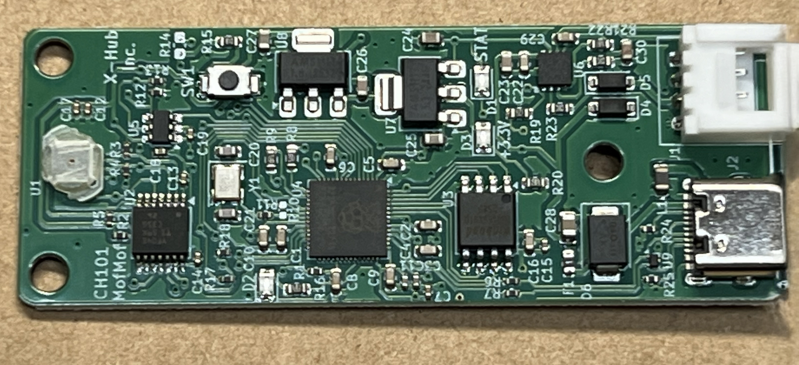
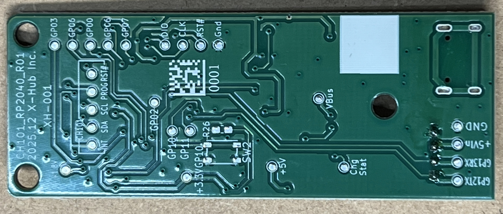
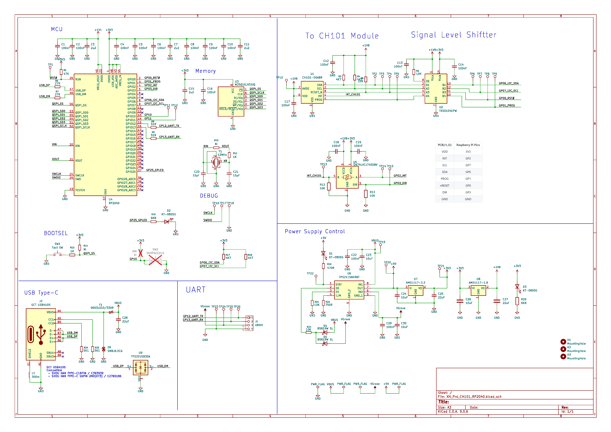

# もふもふセンサーボード

## 概要

もふもふセンサーボードは、TDK InvenSense の超音波 ToF センサ **CH101** を用いて、
物体の「やわらかさ（Mof-Mof）」を検出するユニークなセンサ体験ができる評価用ボードです。

本製品には、TDK InvenSense が GitHub 上で公開している **Mof-Mof Detection ファームウェア**を書き込み済みで、
USB ケーブルを接続するだけで、Mof-Mof センサの動作を体験できます。

---

## 製品写真

### 表面

### 裏面

---

## 特徴

- [TDK InvenSense CH101 超音波 ToF センサ](https://product.tdk.com/ja/search/sensor/ultrasonic/tof/info?part_no=CH101) による、やわらかさ検出を体験可能
- Mof-Mof Detection ファームウェア書き込み済み
- USB 接続のみで動作確認が可能
- **USB 接続時は、USB CDC ACM（仮想シリアル）デバイスとして認識され、Tera Term などのシリアルコンソールソフトから利用できます**
- Grove コネクタ経由で外部 MCU からの接続にも対応
- センサ評価・デモ・学習用途に適した構成

---

## 主な仕様

| 項目 | 内容 |
| --- | --- |
| 搭載センサ | CH101（超音波 ToF センサ） |
| マイコン | RP2040 |
| 電源入力 | USB Type-C（5V） / Grove コネクタ（5V） |
| MCU インターフェース (Grove) | 3.3V UART |
| 無線機能 | なし |
| 技適 | 対象外 |

---

## 回路図

---

## RP2040 接続

| CH101 | RP2040 |
| --- | --- |
| INT | GP2 |
| SCL | GP7 |
| SDA | GP6 |
| PROG | GP1 |
| nRESET | GP0 |
| DIR | GP3 |

---

## Grove 接続

| Grove | RP2040 |
| --- | --- |
| Pin 1 | GP12 |
| Pin 2 | GP13 |
| VCC | +5V (Input)  |
| Gnd | Gnd |

---

## ドキュメント

- ピン配置 / I/O 対応表：[`docs/pinout.md`](docs/pinout.md)
- 回路図：[`docs/schematic_RevR01.pdf`](docs/schematic_RevR01.pdf)

---

## 対象ユーザー

- Mof-Mof Detection ファームウェアを試してみたい方  
- CH101 センサデバイスに興味がある方  
- 超音波 ToF センサの評価・体験を行いたい開発者・研究用途の方  

※ 本製品は評価・体験用途向けであり、一般向けの完成品ではありません。

---

## 付属品・別途必要なもの

### 付属品

- なし（基板のみ）

### 別途必要なもの

- USB 接続で使用する場合  
  - USB Type-C ケーブル  
  - USB CDC ACM（仮想シリアル）デバイスを認識可能な PC  
  - シリアルコンソールソフト（例：Tera Term）
- Grove 接続で使用する場合  
  - Grove ケーブル  
  - 接続先の外部 MCU  

---

## ファームウェアについて

### 出荷時ファームウェア（書き込み済み）

本製品には、TDK InvenSense が公開している  
**Mof-Mof Detection ファームウェア**を書き込み済みで出荷しています。

- 公開元リポジトリ  
  <https://github.com/tdk-invn-oss/ultrasonic.mofmofdetection>

---

### Grove コネクタ対応ファームウェア（派生版）

Grove コネクタ経由での接続を想定し、I/O 定義を調整した派生ファームウェアを
以下のリポジトリで公開しています。

- フォーク先リポジトリ  
  <https://github.com/haruka-imgr/ultrasonic.mofmofdetection-grove>

このリポジトリは、  
TDK InvenSense が公開している `ultrasonic.mofmofdetection` をフォークし、
Grove コネクタ向けに I/O 定義を変更したものです。

※ 派生ファームウェアの使用は任意です。  
※ 使用にあたっては、各リポジトリに記載されているライセンス条件に従ってください。

---

## 商用利用および保証について

- 本製品は、購入者の責任において商用利用していただくことが可能です。
- 本製品の保証は、初期不良に限り対応します。

### 初期不良の定義

以下の条件を満たす場合に、初期不良として対応します。

- 購入後、未改造の状態、またはファームウェア書き替え後であっても  
  ハードウェア起因と判断できる不具合であること
- 正常な使用条件下において  
  - 電源を投入しても動作しない  
  - USB 接続時にデバイスとして認識されない  
  - センサが全く反応しない  
  など、基本的な動作が確認できない場合
- 初期不良対応は、商品到着後7日以内にご連絡いただいた場合に限ります。
- ファームウェアを書き替えた後に不具合が発生した場合でも、初期状態に戻した上で
  同様の不具合が再現する場合は、初期不良として対応します。

### 保証対象外

以下の場合は、保証対象外となります。

- ハードウェア起因かソフトウェア起因かの切り分けが困難な不具合  
- 購入者による回路改造、はんだ付け、配線変更後の不具合  
- 誤った電源接続、過電圧、逆接続による故障  
- 落下、衝撃、過度な押し付けなどによる物理的破損  
- ファームウェアの動作内容や実装方法に起因する不具合  

---

## 注意事項

- 本製品は評価・体験用途向けの製品です。完成品ではありません。
- センサ部は精密部品のため、硬い物体を強く押し当てたり、衝撃を与えたりしないでください。
- 本製品の使用は自己責任でお願いします。
- 本製品は無線機能を搭載していないため、電波法（技適）の対象外です。

---

## 品質について

- 本製品は、出荷前に全数動作確認を行っています。

---

## サポートページ

製品に関する最新情報・ドキュメントは以下に掲載予定です。  
<https://github.com/haruka-imgr/mofmof-sensor-board>  
